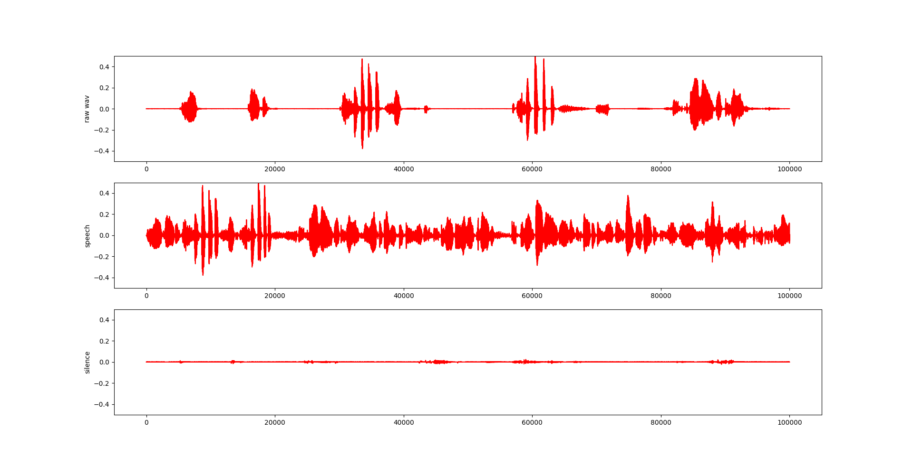

<h1 align="center"> Project1 基于短时能量和短时过零率的VAD</h1>
<h3 align="center"> 516030910595 闫鸿宇 </h3>

## 一 概述

在语音识别的实验中，大多数时候无声部分属于无用信息，所以通常第一步是进行语音活性检测（Voice Activity Detection，VAD），将静音部分剔除。本实验是利用短时能量检测和短时过零率的检测，实现简单的VAD。

关键词：VAD，短时能量，短时过零率，阈值判断。
## 二 数学原理
    
所取帧的短时能量和短时过零率的定义如下。    

__短时能量__
    $$ E(i) = \sum_{i=0}^{N-1}s^2_i $$
__短时过零率__
    $$ Z(i) = \sum_{i=1}^{N-1}|sgn[s(n)]-sgn[s(n-1)]|$$
    $$ sgn[n] = \begin{cases} 1, x \geq 0 \\ 0, x \leq 0 \end{cases} $$
本实验中，使用方窗作为窗函数。
对于每一帧，通过计算短时能量和短时过零率来预测是否在说话：设置阈值，当这一帧的短时能量大于某个阈值、且短时过零率大于某个阈值时认为这一帧是speech，否则认为其是silence。
## 三 算法实现

#### 1. 读入wav数据和归一化处理
由于两个音频文件中说话人的声音大小不同，不方便选用相同的阈值来判断是否在说话，所以对读入的音频信息做了归一化处理。
```python
    waveData = librosa.load(wav1, sr=None)
    waveData = waveData / max(abs(waveData)) #归一化
```
分帧时不足部分用0补齐。
#### 2. 计算短时能量和过零率并选择阈值
计算画图后，尝试用整段语音的平均值作为阈值，发现效果并不理想，将大量语音部分误判为静音部分。

通过观察数据手动选择调整，红色横线为threshold。选取的短时能量和过零率的阈值均为0.01。

#### 3. 根据阈值判断每一帧的类型并输出
当这一帧的短时能量和过零率都大于相应阈值时为speech，否则为silence
```python
for i in range(len(energy)):
		if (status == 0): # 0 : silence
			if energy[i] > ste_threshold and zcr[i] > zcr_threshold:
				print last*25,i*25,"sil"
				last = i
				status = 1
				points.append(i)
		elif status == 1: # 1 : speech
			if energy[i] < ste_threshold or zcr[i] < zcr_threshold:
				print last*25,i*25,"speech"
				last = i
				status = 0
				points.append(i)
	if status == 0:
		print last*25, i*25, "sil"
	else:
		print last*25, i*25, "speech"
```


## 四 结果分析
剪切结果（仅截取剪切前后各语音的开头一小部分）：

发现效果还是比较理想的，声音较小的部分均被剪切掉。但第二段音频的一些语音部分被误判成silence，可能是由于在一帧的边缘有少量speech，但整帧加起来被判定成silence，可能通过加窗（如hamming窗）能够改善这一情况。

__局限性__
* 一些音量较大的噪音，虽然不是人说话的声音，但也没有被检测出来。
* 有停顿减少，语速加快的现象，对说话的节奏有一定程度的破坏，如果在这样的音频基础上做进一步研究可能会有影响。
## 5. 可能的优化方向
-  对信号进行加窗处理，如汉明窗等
- 对语音信号分帧后对每帧进行傅立叶变换，将频率过高和过低的部分去除，逆傅立叶变换回来，再对处理后的语音信号计算短时能量等。

## 6. 附录
#### speech.py
```python 
from Tkinter import *
import librosa
import wave
import math
import matplotlib.pyplot as plt
import numpy as np

#wav1 = '1.wav'
wav1 = 'en_4092_a.wav'
frameSize = 200
overLap = 0
zcr_threshold = 0.01
ste_threshold = 0.01
#ste_threshold_low = 1

def read_wave_data(file_path):
	wave_data = librosa.load(wav1, sr=None)
	return wave_data

def enframe(waveData, frameSize, stepLen):
	'''
	waveData  : raw data
	frameSize : length of each frame
	stepLen   : inc between frames
	return an array of [frameSize, ceil(len(waveData) / stepLen)]
	'''
	wlen = len(waveData)
	frameNum = int(math.ceil(wlen*1.0/stepLen))
	pad_length = int((frameNum-1)*stepLen+frameSize)
	zeros = np.zeros((pad_length-wlen,))
	pad_signal = np.concatenate((waveData, zeros))

	indices = np.tile(np.arange(0,frameSize),(frameNum,1)) \
			+ np.tile(np.arange(0, frameNum*stepLen, stepLen),
			 (frameSize, 1)).T
	indices = np.array(indices, dtype = np.int32)
	frames = pad_signal[indices]
	# To avoid DC bias, we perform mean subtractions on each frame
#	for i in range(frameNum):
#		frames[i] = frames[i] - np.median(frames[i])
	return frames

def main():
	waveData = read_wave_data(wav1)
	waveData = waveData[0]*1.0
	waveData = waveData / max(abs(waveData))
#	wavefft = np.fft.rfft(waveData)
	# calculate the short-time-energy
	frame = enframe(waveData, frameSize, frameSize)
	energy = sum(frame.T*frame.T)
#	volume = 10 * np.log(energy)
	# calculate the zero-cross-rate
	tmp1 = enframe(waveData[0:len(waveData)-1], frameSize, frameSize)
	tmp2 = enframe(waveData[1:len(waveData)], frameSize, frameSize)
	signs = (tmp1*tmp2) < 0
	diffs = (tmp1-tmp2) > 0
	zcr = sum(signs.T*diffs.T)
	points = []
	status = 0
	last = 0
#	ste_threshold = np.average(energy)
#	zcr_threshold = np.average(zcr)
	for i in range(len(energy)):
		if (status == 0): # 0 : silence
			if energy[i] > ste_threshold and zcr[i] > zcr_threshold:
				print last*25,i*25,"sil"
				last = i
				status = 1
				points.append(i)
		elif status == 1: # 1 : speech
			if energy[i] < ste_threshold or zcr[i] < zcr_threshold:
				print last*25,i*25,"speech"
				last = i
				status = 0
				points.append(i)
	if status == 0:
		print last*25, i*25, "sil"
	else:
		print last*25, i*25, "speech"

	#draw the wave
	showLen = 100000
	plt.subplot(311)
	plt.plot(waveData[0:showLen], c = 'r')
	plt.ylabel("Raw wave")
	plt.subplot(312)
	plt.plot(energy[0:showLen // frameSize], c = "b")
	plt.plot([0,showLen // frameSize-1], [ste_threshold, ste_threshold],
		c = 'r')
	plt.ylabel("Short Time Energy")
	plt.subplot(313)
	plt.plot(zcr[0:showLen // frameSize], c = "g")
	plt.plot([0,showLen // frameSize-1], [zcr_threshold, zcr_threshold], 
		c = 'r')
	plt.ylabel("Zero Cross Rate")
	plt.plot()
	plt.show()
	return

if __name__ == "__main__":
	main()

```