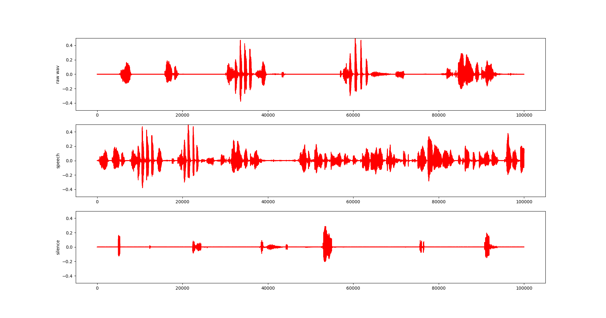

<h1 align="center"> Project2 基于GMM的VAD</h1>
<h3 align="center"> 516030910595 闫鸿宇 </h3>

## 一 概述

在语音识别的实验中，大多数时候无声部分属于无用信息，所以通常第一步是进行语音活性检测（Voice Activity Detection，VAD），将静音部分剔除。本实验是利用MFCC系数和高斯混合模型（Gaussian Mixture Model, GMM）进行VAD。

关键词：VAD，MFCC，GMM。
## 二 原理
#### 1. MFCC
将时域信号转换成频域信号，再转到Mel域信号，再计算Mel域的FBank系数（一系列频段的信号和），衍生得到MFCC系数。
#### 2. GMM
__高维空间上的高斯分布__
    $$ N(x | \mu, \Sigma ) = \frac{1}{(2\pi)^\frac{d}{2} |\Sigma|^\frac{1}{2}} exp\left \{-\frac{1}{2}(x-\mu)^T\Sigma^{-1}(x-\mu) \right\} $$
    这里$\mu$为均值，$\Sigma$为协方差矩阵
__高斯混合模型__
    1. 有c(i)的概率属于第i个单高斯分布
    2. 在第i个高斯分布中，出现在点x的概率为$p_m(x)$类似于将多个高斯分布进行加权求和。
    $$ p(x) = \sum_{m=1}^{M}c_m N(x|\mu_m, \Sigma_m) \ s.t. \sum_{m=1}^{M}c_m = 1$$
    
## 三 算法实现

MFCC特征提取将一帧信号映射到39维空间中的一个点，
有三个GMM，分别刻画了speech, silence, noise在这39维空间的概率分布。
这里用到的高斯混合模型是助教提供的已经训练好的高斯混合模型（vad.gmm），文件提供了三个GMM，分别刻画了speech, silence, noise的概率分布。

#### 1. 对音频文件提取MFCC特征
利用HTK工具包中的HCopy进行提取，命令为
```bash
HCopy -C  config.feat -S feats.scp
```
提取帧宽为25ms，相邻两帧帧首时间间隔为10ms，每帧有39个MFCC系数，得到两个MFCC文件，
#### 2. 导入GMM模型
根据每一行前面的label进行相应数据的读入
'\<MEAN>'指单个高斯模型在各维的均值，'\<VARIANCE>'指单个高斯模型在各维的方差，'\<MIXTURE>'后给出了高斯混合模型中属于每个单高斯的概率，即上式中的$c_m$。

```python
openfile = open('vad.gmm','r')
means = []
variances = []
weights = []

for line in openfile:
    if '<MEAN>' in line:
        nextline = next(openfile)
        mean = np.array(nextline.split()).astype(float)
        means.append(mean)
    elif '<VARIANCE>' in line:
        nextline = next(openfile)
        variance = np.array(nextline.split()).astype(float)
        variances.append(variance)
    elif '<MIXTURE>' in line:
        [str, num, weight] = line.split()
        weights.append(float(weight))


variances.remove(variances[0])
means = np.array(means)
means_speech = means[0:128, :]
means_sil = means[128:256,:]
means_noise = means[256:384,:]

variances = np.array(variances)
variances_speech = variances[0:128, :]
variances_sil = variances[128:256,:]
variances_noise = variances[256:384,:]

weights = np.array(weights)
weights_speech = weights[0:128]
weights_sil = weights[128:256]
weights_noise = weights[256:384]

class GaussianMixture():
    def __init__(self, __means, __variances, __weights):
        self.__means = np.array(__means)
        self.__variances = np.array(__variances)
        self.__weights = np.array(__weights)
    ...
gmm_speech = GaussianMixture(means_speech, variances_speech, weights_speech)
gmm_sil = GaussianMixture(means_sil, variances_sil, weights_sil)
gmm_noise = GaussianMixture(means_noise, variances_noise, weights_noise)
```
#### 3. 利用GMM进行预测
计算每个信号帧所对应的高维空间点属于每个GMM的概率，取其中概率最大的作为当前帧的标记，比如有24%的概率属于speech，有25%的概率属于silence，20%的概率属于noise，则判断这一帧属于silence。
计算过程为：计算128个单高斯的概率，再加权求和。其中每个单高斯的各维独立（因为协方差矩阵为对角阵），可将各维分别当作一维高斯分布分别计算后再求和得到单高斯的概率。
```python
def gaussian(x, mu, sigma):
    ans = 0.0
    for i in range(39):
        ans = ans + np.exp(-0.5*(x[i]-mu[i])*(x[i]-mu[i])/sigma[i])
    return ans
class GaussianMixture():
    ...
    def predict(self, x):
    ans = np.zeros(x.shape[0])
    for j in range(x.shape[0]):
        for i in range(128):
            ans[j] = ans[j] + self.__weights[i] * \
            gaussian(x[j], self.__means[i], self.__variances[i])
    return ans
```
## 四 结果分析
剪切结果（仅截取剪切前后各语音的开头一小部分）：

在Project1中出现了两个问题：语速变快；大音量噪音无法识别。而在本实验中这两个问题得到了很好的解决。
试听时发现人说话时候的节奏正常，语速没有出现明显加快。且大音量噪音被很好的清除出去了（如吸气的声音和一些失真的声音）。

## 五 附录
#### speech.py
```python
import struct
import numpy as np
import sys
from sklearn import mixture

def readhtk(fname):
    # Read header
    with open(fname, 'rb') as f:
        nSamples, sampPeriod, sampSize, parmKind = struct.unpack(
            ">iihh", f.read(12))

        # Read data
        data = struct.unpack(
            ">%df" % (nSamples * sampSize // 4), f.read(nSamples * sampSize))
        return np.array(data).reshape(nSamples, sampSize // 4)


x = readhtk("./wav/chen_0004092_A.mfcc")

openfile = open('vad.gmm','r')
means = []
variances = []
weights = []

for line in openfile:
    if '<MEAN>' in line:
        nextline = next(openfile)
        mean = np.array(nextline.split()).astype(float)
        means.append(mean)
    elif '<VARIANCE>' in line:
        nextline = next(openfile)
        variance = np.array(nextline.split()).astype(float)
        variances.append(variance)
    elif '<MIXTURE>' in line:
        [str, num, weight] = line.split()
        weights.append(float(weight))


variances.remove(variances[0])
means = np.array(means)
means_speech = means[0:128, :]
means_sil = means[128:256,:]
means_noise = means[256:384,:]

variances = np.array(variances)
variances_speech = variances[0:128, :]
variances_sil = variances[128:256,:]
variances_noise = variances[256:384,:]

weights = np.array(weights)
weights_speech = weights[0:128]
weights_sil = weights[128:256]
weights_noise = weights[256:384]
#print sum(weights_speech)   # 0.999961334
#print sum(weights_sil)      # 0.999860007
#print sum(weights_noise)    # 0.999980227

def gaussian(x, mu, sigma):
    """
    multi-dimentional guassian distribution
    """
    ans = 0.0
    for i in range(39):
        ans = ans + np.exp(-0.5*(x[i]-mu[i])*(x[i]-mu[i])/sigma[i])
    return ans

class GaussianMixture():
    def __init__(self, __means, __variances, __weights):
        self.__means = np.array(__means)
        self.__variances = np.array(__variances)
        self.__weights = np.array(__weights)
    def __str__(self):
        return "means = %s\nvariances = %s\nweights = %s" % \
        (self.__means,self.__variances, self.__weights)
    def predict(self, x):
        ans = np.zeros(x.shape[0])
        for j in range(x.shape[0]):
            for i in range(128):
                ans[j] = ans[j] + self.__weights[i] * \
                gaussian(x[j], self.__means[i], self.__variances[i])
            if j % (x.shape[0] / 10) == 0:
                print >>sys.stderr, "%s %%" % (j / (x.shape[0] / 10)*10)

        return ans


gmm_speech = GaussianMixture(means_speech, variances_speech, weights_speech)
gmm_sil = GaussianMixture(means_sil, variances_sil, weights_sil)
gmm_noise = GaussianMixture(means_noise, variances_noise, weights_noise)

#x = x[0:1000,:]
prob_speech = gmm_speech.predict(x)
prob_sil = gmm_sil.predict(x)
prob_noise = gmm_noise.predict(x)

#print prob_speech
#print prob_sil
#print prob_noise

n = x.shape[0]
last = 0
status = 0
for i in range(n):
    if i*10 < last:
        continue
    if status == 0:
        if prob_speech[i] > prob_sil[i] and prob_speech[i] > prob_noise[i]:
            print last, i*10 + 25, "sil"
            last = i*10 + 25
            status = 1
    elif status == 1:
        if not(prob_speech[i] > prob_sil[i] and prob_speech[i] > prob_noise[i]):
            print last, i*10 + 25, "speech"
            last = i*10 + 25
            status = 0
    pass

```